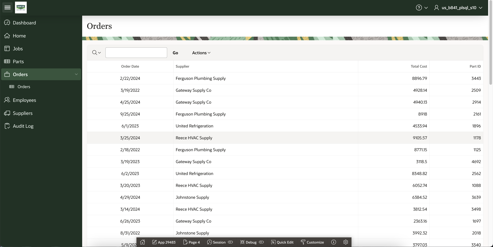

[Back to Portfolio](./)

## Parts Inventory Database (Inspired By ServiceTitan)

===========================================

-   **Class: CSCI 419 Database Management** 
-   **Grade: B+** 
-   **Language(s): SQL (Oracle APEX)** 
-   **Source Code Repository:** [NoahCHuber/HVACInventoryDatabase](https://github.com/NoahCHuber/HVACInventoryDatabase)  
    (Please [email me](mailto:hubercnoah@gmail.com?subject=GitHub%20Access) to request access.)

## Project description

Lorem ipsum dolor sit amet, consectetur adipiscing elit, sed do eiusmod tempor incididunt ut labore et dolore magna aliqua. Ut enim ad minim veniam, quis nostrud exercitation ullamco laboris nisi ut aliquip ex ea commodo consequat. Duis aute irure dolor in reprehenderit in voluptate velit esse cillum dolore eu fugiat nulla pariatur. Excepteur sint occaecat cupidatat non proident, sunt in culpa qui officia deserunt mollit anim id est laborum.

## Development

This project was developed through Oracle Apex as a database application. 
Access to the application is limited to the student and professor. 

However, the SQL used to generate the tables can be run in a separate database and will generate the proper tables. 

## UI Design

Almost every program requires user interaction, even command-line programs. Include in this section the tasks the user can complete and what the program does. You don't need to include how it works here; that information may go in the project description or in an additional section, depending on its significance.

  
Fig 1. Dashboard/Home screen

  
Fig 2. Jobs screen

  
Fig 3. List of all orders

Fig 4. List of all parts

## 3. Additional Considerations

Sed ut perspiciatis unde omnis iste natus error sit voluptatem accusantium doloremque laudantium, totam rem aperiam, eaque ipsa quae ab illo inventore veritatis et quasi architecto beatae vitae dicta sunt explicabo. 

For more details see [Github Oracle Apex Repo](https://github.com/oracle/apex).

[Back to Portfolio](./)
