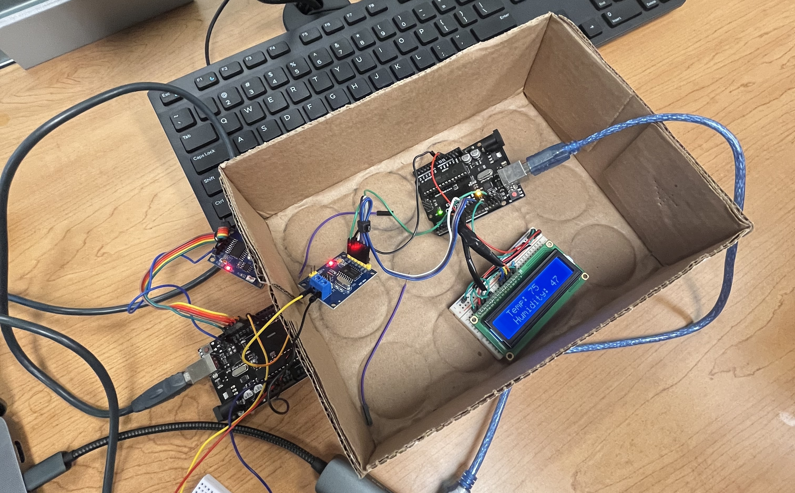

[Back to Portfolio](./)

Linux, Virtual Machines, & System Observation
===============

-   **Class: CSCI352 Cyber Defense** 
-   **Grade: A** 
-   **Language(s): Bash/Terminal**
-   **Source Code Repository:** [NoahCHuber/Linux, Virtual Machines, & System Observation](https://github.com/NoahCHuber/Linux-Virtual-Machines-System-Observation/tree/main)    
    (Please [email me](mailto:hubercnoah@gmail.com?subject=GitHub%20Access) to request access.)

## Project description

The Controller Area Network (CAN
Bus) is a communication protocol
widely used in the automotive
industry and industrial applications.
It enables multiple electronic
control units (ECUs) to
communicate with each other over
a two-wire network, facilitating
real-time data exchange with high
reliability and fault tolerance.

## How to compile and run the program

- Download source code and important into two instances of Arduino IDE.
- Open source code in Arduino IDE and push the code to each board. (Note: There are two separate code files for each board)
- Once the code is pushed start the board with the temperature sensor first then the receiving/display end. 
- Wait for the display to start and output the data.

## UI Design

This setup uses a simple Liquid Crystal Display (LCD) and outputs the temperature. There is zero human input to this program after
it is running. The temperature is monitored by the sensor and formatted as output on the LCD. 

Fig.1 Setup and Output on the LCD

## Video Demonstration

Here is a short overview and demonstration video [CanBus Video](https://youtu.be/A2FlE2YflOg).

## 3. Additional Considerations

This is a barebones setup, beginning understanding and working with Can Bus communication. 
This project only controls the LCD and reads data from the temperature sensor. The code is easily adaptable.

For more details or advanced look inside [Arduino CanBus Github Repo](https://github.com/autowp/arduino-mcp2515)  

[Back to Portfolio](./)
