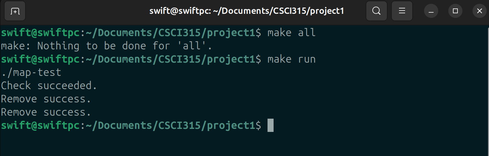
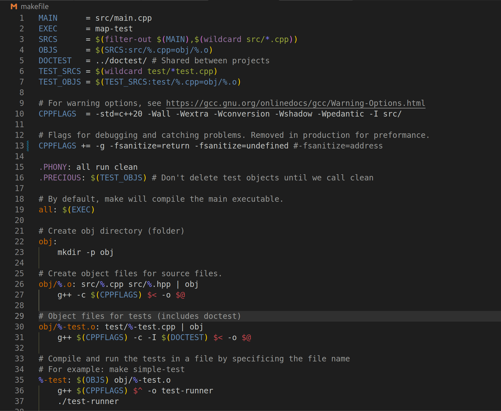
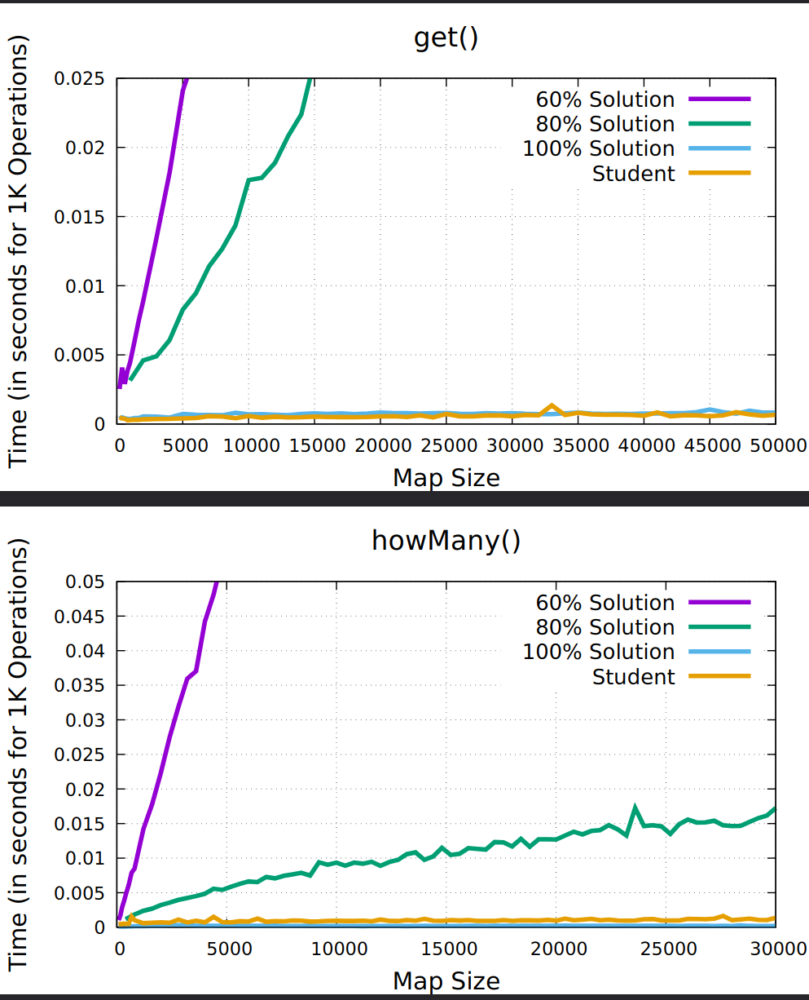

[Back to Portfolio](./)

## Large Map Project C++

-   **Class: CSCI315 Data Structure Analysis** 
-   **Grade: A+** 
-   **Language(s): C++** 
-   **Source Code Repository:** [NoahCHuber/LargeMap](https://github.com/NoahCHuber/LargeMap)  
    (Please [email me](mailto:hubercnoah@gmail.com?subject=GitHub%20Access) to request access.)

## Project description

The Large Map Project is a data structure implementation designed to efficiently map student names to unsigned integer IDs. The challenge is to develop a system that can store and retrieve these mappings while optimizing memory usage and performance. Unlike generic key-value storage solutions, this project was constrained by the prohibition of utilizing hash maps. This project encouraged students to explore alternative types such as arrays, pointers, or linked lists. The purpose of the project is to understand how to design and implement efficient data structures tailored to specific constraints, memory footprint, and search efficiency. The program must support operations like inserting new name-ID pairs, retrieving IDs by name, deleting entries, and counting names with a specific prefix, all while ensuring that performance remains reasonable. Storing all possible name combinations would exceed 5.5GB, deeming it unpractical to use linear search methods. Other search methods like binary search are much more efficient. This project serves as a demonstration of implementing data structures for specific tasks with optimized performance. 

## How to compile and run the program

**Compiling the Program**

Since this is a C++ project, you need to use g++ to compile the source files. 
However, given the makefile, you can compile and run much easier.

You can compile the program using the following command:

**make all**

Given the makefile, the program should be compiled automatically.

**Running the Program**

After compiling, you can run the program with:

**make run**

Depending on the implementation, the text files can be swapped. 
However, there is no human interaction when the program is running. 

## UI Design

Although this application does not have an interactive UI, the user can still technically interact with the program through the command line. 

  
Fig 1. Command Line. 
(Demonstrates how the makefile can be used to compile and run the program)

Fig 2. Makefile options. (Shows the makefile options that can be used)

  
Fig 3. Actual Testing Data from the program. 
(Data that was recorded when running the program)

## 3. Additional Considerations

Lower-performance computers with limited RAM and slower processors may struggle to efficiently run the program, especially when handling large datasets. Optimizing memory usage and algorithm efficiency is crucial to maintaining good performance across different systems. Alternative methods such as binary search in sorted arrays or trie structures for prefix searches could improve lookup speeds while minimizing memory overhead. For a proper implementation in a fledged program thorough testing is required, including edge cases like duplicate names, missing entries, and varying dataset sizes. Debugging can be performed with assertions, print statements, and profiling tools, which can help identify performance bottlenecks and logical errors.

**Key Points:**
- Performance Limitations: Slower machines may struggle with large datasets.
- Optimization Strategies: Sorted arrays (for binary search) or tries (for prefix lookup) can improve efficiency.
- Testing & Debugging: Use assertions, print statements, and profiling tools to validate correctness and performance.

For more details see [CSU Data Structures](https://github.com/csu-cs/CSCI-315-2024-Fall).

[Back to Portfolio](./)
