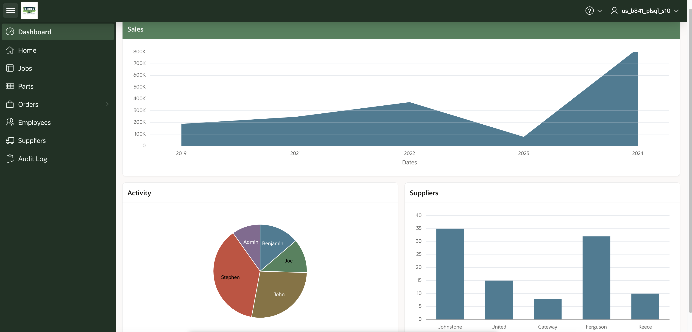
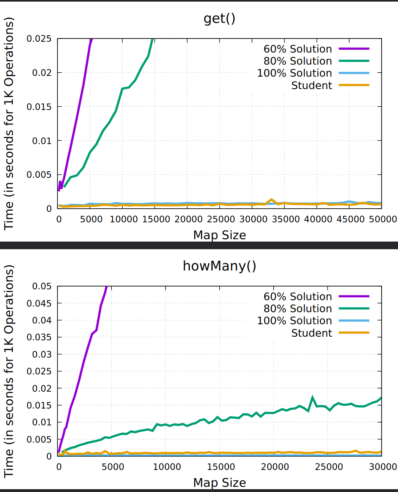

Senior Portfolio
=========

Programming Projects
--------------------

*For access to my private project repositories, please [email me](mailto:hubercnoah@gmail.com?subject=GitHub%20Access) with the subject line, GitHub Access.

---
### [Sending Data Across A Can Bus | CSCI 332](CanBus.md)

---
### [Inventory DataBase (Inspired By ServiceTitan) | CSCI 419](Inventory.md)

---
### [Large Map | CSCI 315](Map.md)

---
### [MineField | CSCI 325](Minefield.md)

---

Ethics Papers
-------------

### [Ethical Implications of Cybersecurity](/pdf/CSCI325 Ethics Paper - Noah Huber.pdf)

-   **Class: CSCI 325: Object Oriented Programming**  
-   **Grade: A**

### [Ethics of Professionals in Technology](/pdf/CSCI315 Ethics Paper - Noah Huber.pdf)

-   **Class: CSCI 315: Data-Structure Analysis** 
-   **Grade: A**

### [Ethics of Net Neutrality](/pdf/CSCI332 Ethics Paper - Noah Huber.pdf)

-   **Class: CSCI 332: Applied Networking** 
-   **Grade: A**

---

Presentations
-------------

### [Small Businesses and Cybersecurity](/pdf/SBaC.pdf)

- **Class: CSCI 405: Principles of Cybersecurity** 
- **Grade: A**

### [Sending Data Across A Can Bus](/pdf/CanBus.pdf)

- **Class: CSCI 332: Applied Networking** 
- **Grade: A**

---

Page template forked from <a href="https://github.com/csu-cs/csci-portfolio">CSU-CS</a>

<!-- Remove above link if you don't want to attributive -->
